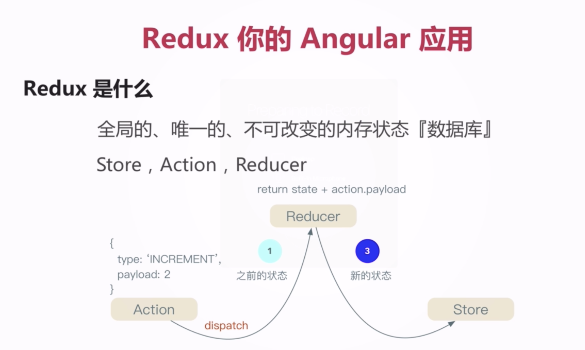
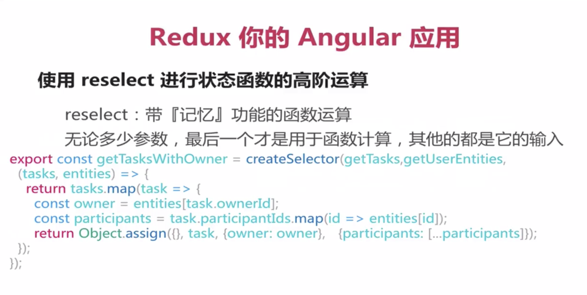

# Redux




**Action** 

action相当于一个事件一个信号。

**Reducer**

纯函数，可以接收任何Action

**Store**

返回的新的状态形式


REDUX开发使用Redux DevTools插件


# 代码实例

实例用于登录页面的名言警句

包含文件有：<br>
login.component.ts  用于发送信号和获取状态<br>
quote.reducer.ts    名言警句的状态处理（局部）<br>
index.ts            用于处理所有的状态（全局）<br>

**login.component.ts**
```
    import {select, Store} from "@ngrx/store";
    import * as fromRoot from '../../reducers';
    import * as actions from '../../actions/quote.action';
    
    constructor(
          private quoteService$: QuoteService,
          private store$: Store<fromRoot.State>
      ) {
        this.quote$ = this.store$.pipe(select((state: any) =>  state.reducer.quote.quote));  // 得到最新的状态
        
        this.quoteService$.getQuote().subscribe(val => { // 请求数据到数据后发送成功的信号
          this.store$.dispatch({type: actions.QUOTE_SUCCESS, payload: val});  // 发送状态
        });
      }
```
this.store$.dispatch()用于发送信号，会被index.ts文件中reducer方法接收到，
然后index.ts将信号发送到对应的局部reducer函数（quote.reducer.ts文件中的reducer函数）


**quote.reducer.ts**
```
import {NgModule} from "@angular/core";
import {ActionReducer, combineReducers, StoreModule} from "@ngrx/store";
import {StoreRouterConnectingModule} from "@ngrx/router-store";
import {StoreDevtoolsModule} from "@ngrx/store-devtools";

import * as fromQuote from "./quote.resucer";
import {compose} from "@ngrx/core";
import {storeFreeze} from "ngrx-store-freeze";
import {environment} from "../../environments/environment";

export interface State {  // 全局的
    quote: fromQuote.State;
}

const initialState: State = { // 全局的初始值
    quote: fromQuote.initialState
}

const reducers = {  // reducer字典 把所有的reduce放进去
    quote: fromQuote.reducer
}

// 合并所有的reducer
const productionReducers: ActionReducer<State> = combineReducers(reducers); // 生产环境
const developmentReducers: ActionReducer<State> = compose(storeFreeze, combineReducers)(reducers); // 开发环境  compose的用法等于 combineReducers(storeFreeze(reducers))

export function reducer(state = initialState, action: any): State { // 全局的，每一个信号都在这里被接收，然后再分发到对应的局部reducer
    return environment.production ?  productionReducers(state, action) : developmentReducers(state, action);
}

@NgModule({
    imports: [
        StoreModule.forRoot({reducer}), 
        StoreRouterConnectingModule.forRoot(),     // 路由store
        StoreDevtoolsModule.instrument()  // 开发者工具调试
    ]
})

export class AppStoreModule {
    
}
```
StoreModule.forRoot({reducer}) 这是此文件的核心，表示{reducer: reducer} 执行reducer函数，
并且以reducer为key的对象形式返回，所以在login.component.ts文件中获取新的状态数据是state.reducer.quote.quote


**quote.reducer.ts**

```
import * as quoteAction from "../actions/quote.action";
import {Quote} from "../domain";

export interface State {
    quote: Quote;
}

export const initialState: State = { // 局部的初始状态
    quote: {
        id: '0',
        cn: '我突然就觉得自己像个华丽的木偶,演尽了所有的悲欢离合,可是背上总是有无数闪亮的银色丝线,操纵我哪怕一举手一投足。',
        en: 'I suddenly feel myself like a doll,acting all kinds of joys and sorrows.There are lots of shining silvery thread on my back,controlling all my action.',
        pic: '/assets/img/quotes/0.jpg'
    }
}

export function reducer(state = initialState, action: {type: string, payload: any}): State {  // 状态发生变化
    switch (action.type) {
        case quoteAction.QUOTE_SUCCESS:
            return {...state, quote: action.payload};  // 相当于Object.assign({}, state, {quote: action.payload})
        case quoteAction.QUOTE_FAIL:
        default: {
            return state;
        }
    }
}
```
这个文件里面的reducer是名言警句的reducer，它只处理名言警句的状态


# reselect
